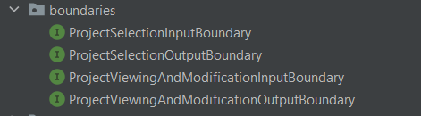
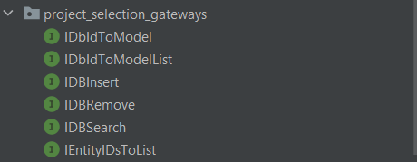
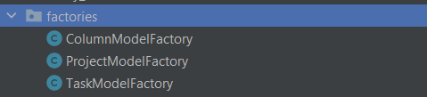

# Kanban Board Program

## Description
This program allows you to create a kanban board,
add a custom number of columns (with any name you desire!),
and add tasks to said columns.

Additionally, you can make modifications to the tasks, columns, and boards (also called "projects").
These modifications include adding descriptions for the tasks,
marking tasks as complete or incomplete
(regardless of the column -- which allows you to use these boards as regular kanban boards,
or just a board with columns of tasks), create new projects/boards, and more!

Database Persistence Demo:

https://github.com/CSC207-2023Y-UofT/course-project-landscape-artists/assets/107582846/020e1da6-7fdf-4bd9-8318-6efedd4e4e5c

## Running the Program
To run the program, ensure that you have Java installed, as well as JavaFX.
This program uses Java Version 17.

To run the program, simply run the `Main.java` file, which can be found in
the folder `src/main/java/`.

## Program Structure and Information
We have constructed the program according to the Clean Architecture and SOLID principles,
as much as possible. One can see that when in the folder `src/main/java/`, the Java files
are split apart, based on the Clean Architecture layer they belong to.
Further folders have been made within each layer to separate the different
Java files, according to their role within the program.

One can find the database files in
`/src/main/java/d_frameworks_and_drivers/database_management/DatabaseFiles`.

## Testing
Our testing efforts centered on the program's inner layers specifically layer A and layer B, and some high-level data 
processing. Here is the current coverage for these layers:

Some of the database controllers tests were omitted due to difficulty's in testing because of 
unexpected behaviours in the database. Controllers, Presenters and other UI related classes are also
excluded from unit testing. Interactor classes are also skipped since it only delegates events into their
respective use case.

To replace the lack of unit testing in these classes, quality assurance testing is conducted. This involves manual 
testing of 
the UI classes, database implementations, and other classes in the C layer. As a result, the database accurately reflects all the changes made to the program, and the UI functions as intended.

***NOTE:*** Certain database testing procedures involve making changes to the CSV database. After 
executing the test suite, please rollback Projects.csv, Columns.csv, and Tasks.csv before relaunching 
the application. This will ensure that the application functions as intended.

## Interfaces

The program aimed to achieve a high level of abstraction by incorporating well-defined contracts between classes. These 
contracts establish a low level of coupling among the classes. The implementation of these interfaces is carried out by 
classes in the outer layer, aligning with the principles of Clean Architecture and making effective use of the Dependency 
Inversion Principle. Below is an illustration showcasing the interfaces utilized within the program.

## Design Patterns
The application also incorporated various design patterns to enhance its structure and extensibility. Three prominent design patterns were utilized:

1. **Factories**: Factories were implemented to facilitate the creation of entities. This design choice was made 
   with future considerations in mind, anticipating the potential need for different types of entities, such as 
   various types of Project entities. By employing factories, the program is designed for easy extensibility, enabling 
   the seamless addition of new entity types.

2. **Iterator**: An iterator pattern was specifically applied to the ViewModel. This approach ensures that the ViewModel, which may contain information sourced directly from the database, is made iterable. This enhances usability by enabling straightforward iteration through ViewModel elements.

3. **Singleton**: Singleton classes were employed to offer global access to a single instance. In this context, a 
   Singleton is used to manage the ProjectEntity. By applying the Singleton pattern, the application ensures 
   consistent interactions with Project entities, directing all such interactions to the same instance—the currently 
   opened Project entity in the UI.

By incorporating these design patterns, the application not only enhances its flexibility and scalability but also adheres to best practices, optimizing specific functionalities.

## Contributers (In Alphabetical Order of Last Name on Quercus)
- Oluwasina OLOWOOKERE
- Sridhar Sairam
- Soumyadip Sarker
- Ronald John Tutor
- Wendy Wan
- Igor Zakhidov
